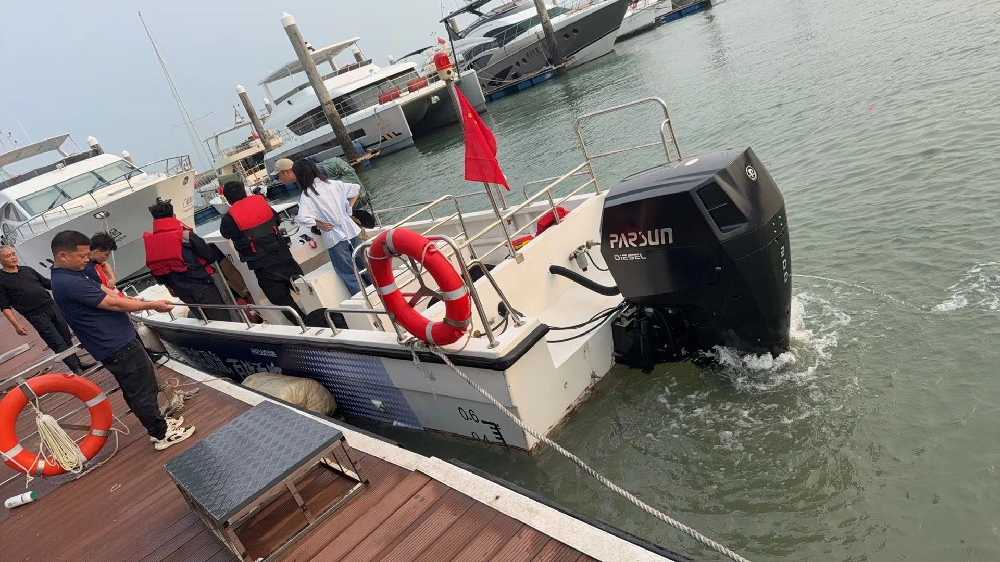
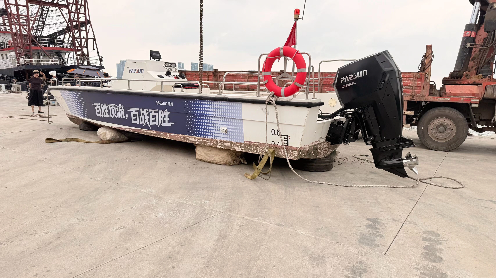

Today, we successfully delivered a **Parsun D200** diesel outboard. The customer was so impressed by the specs that they personally sailed their vessel to **Guangzhou** for professional installation and field testing. 

In the demanding 200HP class, diesel power is rapidly replacing gasoline for commercial and heavy-duty use. But why is the D200 standing out? Let’s look at the data from our recent sea trials.

*Figure 1: Field inspection and testing of the Parsun D200 in Guangzhou.*

---

## The "Strong" Definition: Parsun D200 Technical Breakthroughs

The D200 isn't just an engine; it’s a high-torque powerhouse. 
* **Torque & Power**: It delivers a staggering **400N·m of peak torque**. Compared to traditional powerplants, its high-thrust operating range has been expanded by **68%**, with a **46% boost** in overall power.
* **Safety & Cooling**: Utilizing diesel fuel and a **closed-loop cooling system**, it ensures much safer refueling and superior thermal management.
* **Transmission**: A unique **belt-drive box design** provides direct transmission and lightning-fast throttle response.
* **Redundancy**: The shafting overload protection offers a **2x safety margin**, crucial for commercial reliability.

---

## The 50% Efficiency Gap: Fuel Consumption Analysis

The most impressive result from our Guangzhou test was the fuel curve. The Parsun D200 shows a **nearly 50% difference between economic cruising fuel consumption and maximum fuel consumption.** This allows operators to drastically extend their range by optimizing cruising speeds—a feat gasoline engines cannot match.

### 200HP Diesel Comparison: Parsun vs. The World

How does the D200 stack up against other major 200HP diesel outboards like the Swedish **OXE 200**?

| Feature | **Parsun D200** | **OXE Marine 200** | **Typical 200HP Petrol** |
| :--- | :--- | :--- | :--- |
| **Fuel Type** | Diesel | Diesel | Gasoline |
| **Peak Torque** | 400 N·m | 415 N·m | ~280 N·m |
| **Fuel Efficiency Gap** | **~50% (Eco vs. Max)** | ~40-45% | ~25-30% |
| **Cooling System** | Closed-Loop | Closed-Loop | Open-Water |
| **Transmission** | Belt-Drive Box | Belt-Drive (High Maintenance) | Gear-Driven |
| **Economic Advantage** | High (Optimal Price/Power) | Premium (High Initial Cost) | Low (High Fuel Cost) |

### **The Verdict on Efficiency:**
While the **OXE 200** is a premium European competitor with slightly higher peak torque, the **Parsun D200** offers a more "aggressive" economic zone. The 50% consumption gap we measured in Guangzhou proves that the D200 is specifically optimized for commercial users who need to minimize operational costs without sacrificing the raw power needed for heavy loads.

---

## Why Choose Diesel for Your Fleet?

Compared to same-horsepower gasoline engines, the D200 offers:
1. **Safety**: Lower volatility of diesel fuel.
2. **Longevity**: Built for thousands of hours of commercial service.
3. **Huge Cost Savings**: Significant reduction in hourly fuel expenditures, especially at cruising speeds.

## Conclusion

Seeing the Parsun D200 in action in Guangzhou confirms its status as a leader in the 200HP diesel segment. It perfectly interprets the definition of "Powerful" while remaining the most economically sensible choice for serious boaters.

**Want to see the D200 in action or get a shipping quote to your port?**
[Contact CN Outboards Store today](#) for expert logistics and technical support.

---
